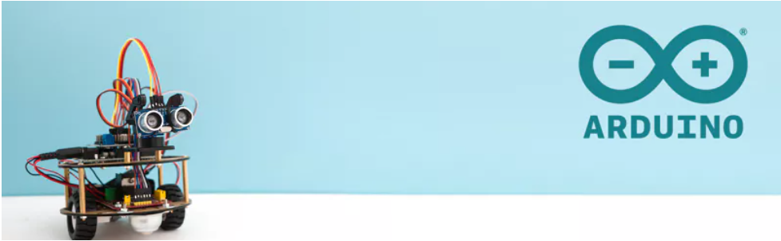
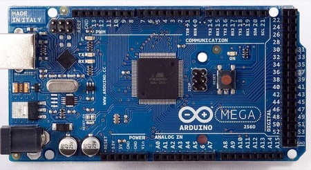

# Tutorial de arduino para beginners



## ¿Qué es un microcontrolador?

Un microcontrolador es un circuito integrado compacto que integra las funciones de una CPU (unidad central de procesamiento) con memoria y periféricos de entrada/salida. Su diseño está optimizado para controlar dispositivos electrónicos y sistemas digitales en aplicaciones específicas. Por lo general, son dispositivos de bajo costo, bajo consumo de energía y, en muchos casos, de dimensiones reducidas.

### Diferencia entre microcontrolador y microprocesador

#### Microcontrolador:
* Integra CPU, memoria y periféricos en un único chip.
* Está diseñado para tareas específicas y aplicaciones dedicadas.
* Consumo de energía generalmente bajo.
* Costo más bajo en comparación con microprocesadores.
* Ideal para controlar sistemas y dispositivos en tiempo real.

#### Microprocesador:
* Principalmente consiste en una CPU y puede requerir componentes adicionales (como memoria RAM, ROM) para funcionar.
* Se utiliza en sistemas de propósito general, como computadoras personales, servidores y estaciones de trabajo.
* Tiene capacidad de procesamiento superior y puede manejar múltiples tareas simultáneamente.
* Generalmente más costoso y consume más energía que un microcontrolador.
* No está optimizado para tareas específicas en tiempo real, sino para un rendimiento general y versatilidad.

#### Aplicaciones comunes de microcontroladores

* Electrodomésticos: Como microondas, lavadoras, y refrigeradores.
* Automatización Industrial: Control de maquinaria y monitoreo de procesos.
* Electrónica de consumo: Relojes, cámaras, televisores.
* Automóviles: Control de sistemas como inyección de combustible, airbags y sistemas antideslizantes.
* Dispositivos médicos: Monitores de signos vitales, bombas de insulina.
* Sistemas de control de acceso: Cerraduras electrónicas y sistemas de seguridad.
* Juguetes electrónicos: Drones, robots y videojuegos.
* Sistemas de comunicación: Teléfonos y radios bidireccionales.
* IOT (Internet de las Cosas): Dispositivos conectados a Internet para recopilación y envío de datos.

## Arquitectura Básica de Microcontroladores

1. CPU
2. Memoria (RAM, ROM, EEPROM)
3. Puertos de E/S
4. Conversor Analógico a Digital (ADC) y Digital a Analógico (DAC)
5. Temporizadores y contadores
6. Sistemas de interrupción




## Historia y origen de Arduino

Arduino es una plataforma de hardware y software de código abierto que se originó en Italia en 2005. Nace de un proyecto de estudiantes en el Instituto Ivrea Interaction Design en Italia, bajo la supervisión de Massimo Banzi y David Cuartielles. El nombre "Arduino" proviene de un bar en Ivrea, Italia, donde algunos de los fundadores del proyecto solían reunirse. El propósito original de Arduino era proporcionar una herramienta económica y fácil de usar para estudiantes y profesionales que no eran necesariamente expertos en electrónica o programación.

#### ¿Por qué Arduino es popular entre los entusiastas y profesionales?

* Accesible: Arduino es de código abierto, lo que significa que su diseño de hardware y software está disponible al público. Esto permite a los usuarios personalizar y expandir según sus necesidades.
* Económico: Comparado con otras plataformas, Arduino es relativamente barato.
* Comunidad: Hay una amplia comunidad global que contribuye con tutoriales, bibliotecas y soluciones a problemas comunes.
* Versatilidad: Se puede usar en una variedad de aplicaciones, desde prototipos rápidos hasta proyectos comerciales.
* Fácil de usar: La programación es sencilla y la curva de aprendizaje es bastante accesible para principiantes.

## Estructura de un programa:

Todo programa de Arduino (también conocido como "sketch") tiene, como mínimo, dos funciones principales:

* setup(): Esta función se ejecuta una sola vez cuando el Arduino se inicia. Se utiliza generalmente para configurar los modos de los pines y para iniciar comunicaciones, entre otras tareas de inicialización.

* loop(): Después de que setup() se ha ejecutado, la función loop() se ejecuta repetidamente en un ciclo infinito. Aquí es donde el estudiante colocará la lógica principal de su programa.

## Variables y tipos de datos:

Las variables se utilizan para almacenar datos que el programa usará. Arduino soporta varios tipos de datos estándar, entre ellos:

* int: Número entero. Ejemplo: int edad = 20;
* float: Número con decimales. Ejemplo: float temperatura = 23.5;
* char: Un solo carácter. Ejemplo: char inicial = 'A';
* byte: Número entre 0 y 255.
* boolean: Valor verdadero (true) o falso (false). Ejemplo: boolean encendido = true;
* String: Cadena de caracteres. Ejemplo: String nombre = "Juan";

## Control de flujo:

Estas estructuras permiten al estudiante controlar cómo se ejecuta el código bajo diferentes condiciones o repetidamente:


If, else

```

if (condición) {
   // código si la condición es verdadera
} else {
   // código si la condición es falsa
}

```

for

```
for(int i = 0; i < 10; i++) {
   // código que se repetirá 10 veces
}

```

While
```

while(condición) {
   // código que se ejecuta mientras la condición sea verdadera
}

```
Switch-case
```
switch(variable) {
  case valor1:
    // código para valor1
    break;
  case valor2:
    // código para valor2
    break;
  default:
    // código si ninguno de los valores anteriores coincide
}

```

## Funciones basicas

Estas con algunas de las funciones mas utilizadas en programacion con Arduino

pinMode(pin, mode): Configura un pin específico como entrada (INPUT) o salida (OUTPUT).
```
 pinMode(13, OUTPUT); Configura el pin 13 como salida.

```

digitalWrite(pin, value): Establece un pin digital a HIGH (alto) o LOW (bajo).
```
digitalWrite(13, HIGH); Establece el pin 13 en alto.

```

digitalRead(pin): Lee el estado de un pin digital, devolviendo HIGH o LOW.
```
int estado = digitalRead(12); Lee el estado del pin 12.

```

analogRead(pin): Lee el valor de un pin analógico, devolviendo un valor entre 0 y 1023.
```
int lectura = analogRead(A0); Lee el valor del pin analógico A0.\

```

analogWrite(pin, value): Envia una señal modulada por ancho de pulso (PWM) a un pin, con un valor entre 0 (siempre apagado) y 255 (siempre encendido).
```
analogWrite(11, 128); Envia un PWM al pin 11 con un valor de 128.

```